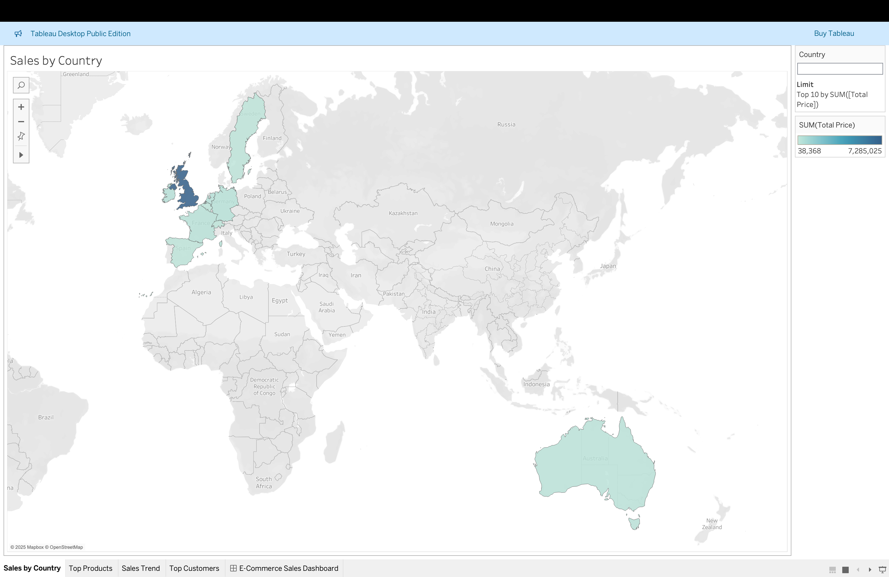
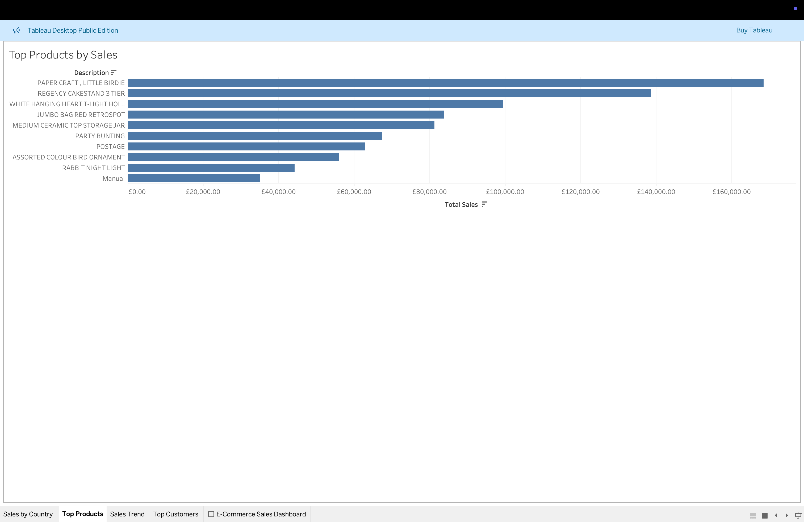
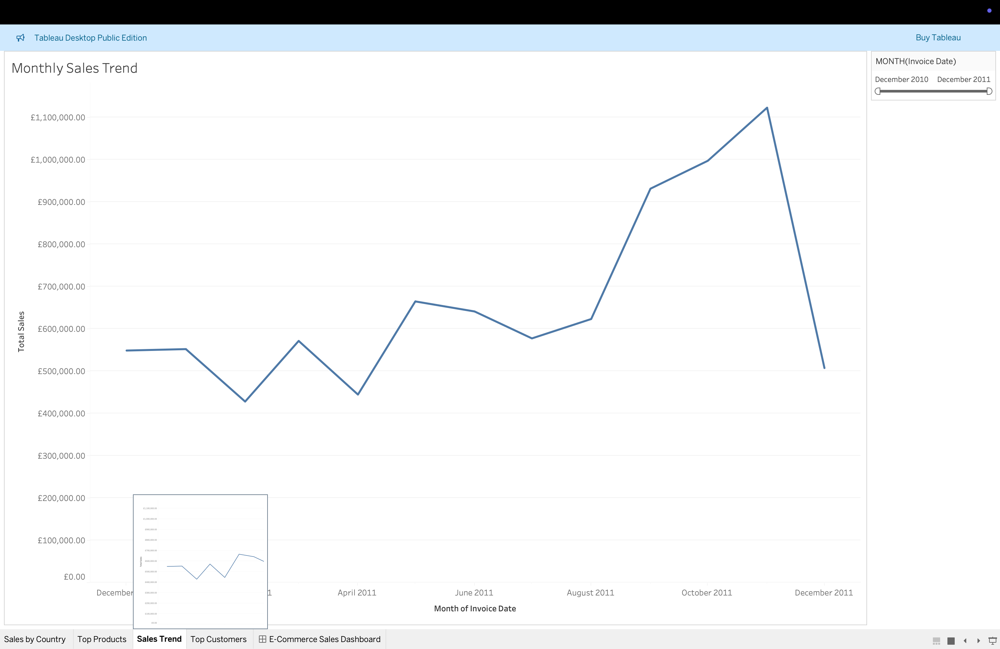
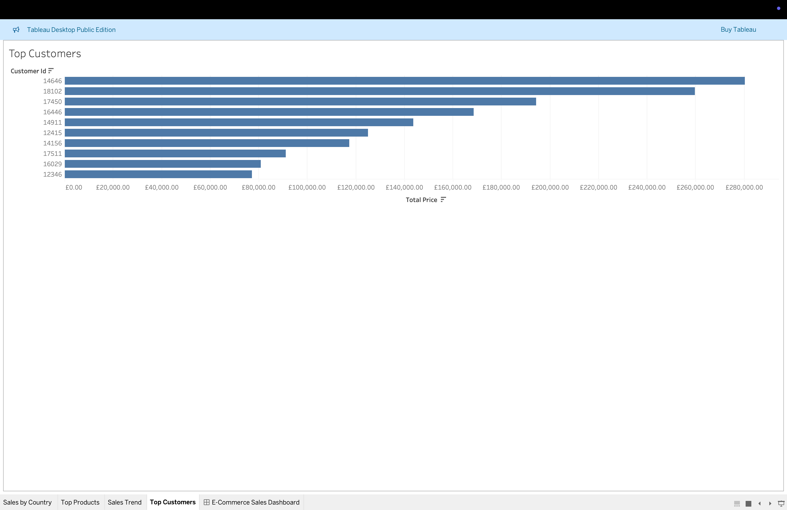
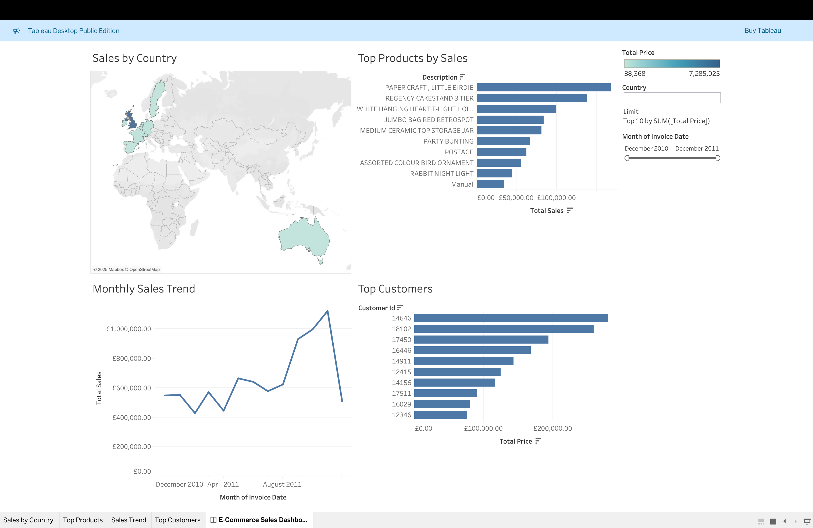

# E-Commerce Sales Dashboard Insights

## Overview
This Tableau dashboard analyzes sales data from the Online Retail Dataset, providing insights into sales performance, customer behavior, and product trends. The dashboard includes interactive visuals for sales by country, top products, sales trends over time, and top customers, with filters for country and date range.

## Key Findings
1. **Sales by Country**:
   - United Kingdom accounts for ~90% of total sales, followed by Germany and France.
   - Opportunity: Expand marketing in high-potential markets like Germany.
   - **Screenshot**: 
2. **Top Products**:
    - Top products include PAPER CRAFT, LITTLE BIRDIE and REGENCY CAKESTAND 3 TIER
    - Action: Increase stock or promotions for these products.
    - **Screenshot**: 
3. **Sales Trends**:
    - Sales peak in November 2011, likely due to holiday shopping
    - Action: Plan inventory and campaigns for peak seasons.
    - **Screenshot**: 
4. **Top Customers**:
    - Customer IDs 14646 and 18102 are top spenders, contributing ~£540,000 in sales.
    - Action: Target these customers with loyalty programs.
    - **Screenshot**: 

## Recommendations
- Focus marketing efforts on top countries (e.g., Germany, France) and products (e.g., "85123A").
- Prepare for seasonal sales spikes (e.g., November) with inventory planning.
- Engage high-value customers (e.g., 17850) with personalized offers.

## Dashboard Access
- Published Dashboard: [E-Commerce Sales Dashboard on Tableau Public](https://public.tableau.com/views/ecommerce-dashboard/E-CommerceSalesDashboard?:language=en-US&:sid=&:redirect=auth&:display_count=n&:origin=viz_share_link)

## Dashboard Screenshots
- Full Dashboard View: 
